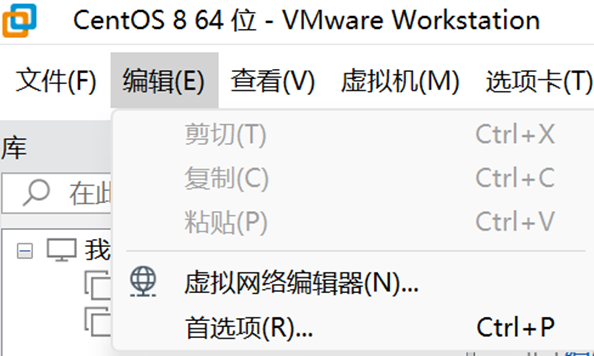
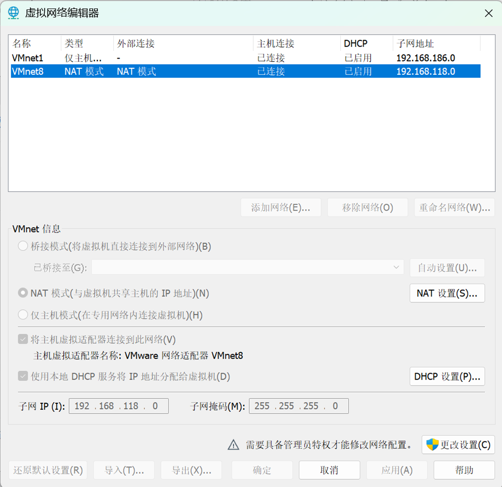

Linux管理-chp1
===========

## 熟悉linux系统界面和基本操作
- 打开虚拟机软件VMWare Workstation，找到已安装的操作系统CentOS 8，并启动。（弹出提示窗口时，请选择“我已复制了虚拟机”选项）。

- 等待CentOS 8系统启动完成后，登录到系统中。用户名是默认的lenovo，密码是123456。(如果不显示密码界面，请按下空格下激活登录界面)。

- 熟悉Linux系统的基本界面和操作。

  - 左上方的**活动**按钮可以打开应用程序菜单，显示系统中安装的应用程序和工具。

  - 右上方的**系统状态栏**显示当前时间、电池状态、网络连接等信息。点击系统状态栏可以访问系统设置和其他功能。

  - 请找到以下应用程序并打开它们：
    - 终端（Terminal）：这是一个命令行界面，可以输入Linux命令进行操作。
    - 文件管理器（Files）：这是一个图形界面工具，可以浏览和管理文件和目录。
    - 文本编辑器（Text Editor）：这是一个简单的文本编辑工具，可以创建和编辑文本文件。
    - Firefox浏览器：这是一个网络浏览器，可以访问互联网。


## 网络连接
注意，首先确保宿主操作系统已连接到网络。

- 在VMWare Workstation软件中，顶部菜单栏找到“编辑”->"虚拟网络编辑器"，在弹出的窗口中点击“添加网络”，选择一个未使用的网络（例如VMNet8），点击“确定”完成添加。
- 如果“添加网络”按钮不可用，请先点击“更改设置”按钮，输入管理员密码后再进行添加。


- 在“虚拟网络编辑器”窗口中，选择刚才添加的网络（例如VMNet8），将“连接类型”设置为“NAT”，点击“确定”保存设置。
- 在子网设置中，确保子网IP地址和子网掩码设置正确，例如：
  - 子网IP地址：192.168.118.0
  - 子网掩码：255.255.255.0



- 在VMWare Workstation软件中，顶部菜单栏找到“虚拟机”->“设置”，将“网络适配器”的“网络连接”设置为NAS模式。
- 在**系统状态栏**中，点击网络图标，查看当前的网络连接状态。

## 使用终端练习文件基本操作
请下载该文件，[basic-file.sh](/files/teaching/2026-spring-teaching-1/basic-file.sh)

存储到/home/lenovo目录下，并使用终端进入该目录，执行以下命令:

```bash
cd /home/lenovo
chmod +x basic-file.sh
./basic-file.sh
```
该脚本将创建一个名为“basic-file-command”的目录。可以使用文件管理器浏览到该目录，查看文件内容如何随着练习的进程而发生变化。


注意：如果提示没有权限，可以通过添加sudo命令来提升权限：
```bash
sudo ./basic-file.sh
```
当提示输入密码的时候，请输入123456（注意输入密码时不会显示任何字符）。

